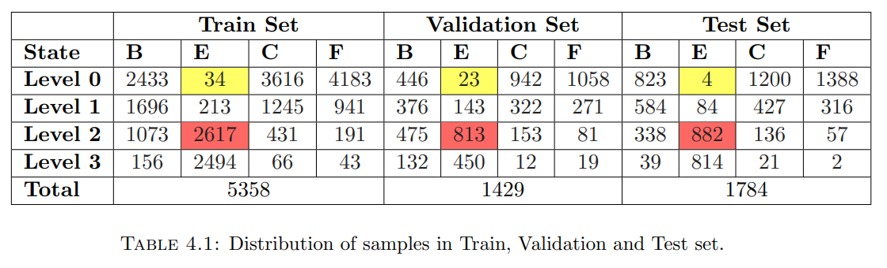
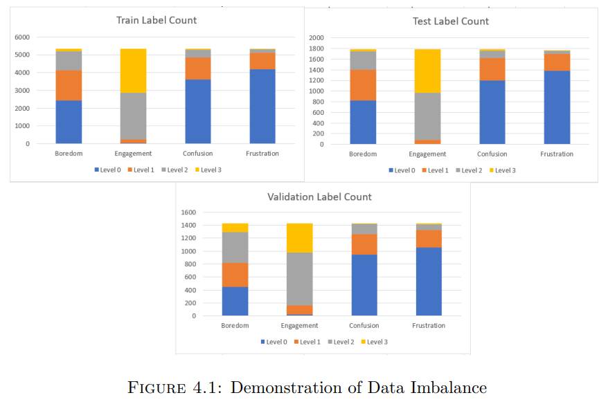

# Multi-task Learning for Student Mental State Recognition from Facial Expressions in-the-wild

### ABSTRACT
E-Learning platforms are most effective when personalised, leading to higher engagement levels and promoting positive, sustained use. In their current state, these platforms have been designed as a one-size-fits-all solution with no adaptation to the emotional and cognitive abilities of students. By understanding learner engagement and other mental states at various junctures of the learning process and how these change throughout the learning activity, we can intuitively design interfaces that support better learner cognition, help decrease dropout rates, and provide a personalised learning experience.
  
In this work, I propose an end-to-end pipeline for “Multi-task Learning of Student Affect Recognition from Facial Expressions in-the-wild”. I have experimented with three novel Convolutional Neural Networks (CNN) and Long Short-Term Memory (LSTM) hybrid networks. Student mental state recognition in the wild has been formulated as a Spatio-temporal problem, and the proposed networks are trained and evaluated on the DAiSEE e-learning video dataset[5]. The deep CNN models serve as feature extractors to produce spatial feature embeddings from successive video frames. The LSTM-based sequence learning arm captures the temporal changes in videos to determine how the mental states change over time. The project also investigates the effects of modifying various parameters and specifications of these networks.

 

The contribution of this work is three-fold:
1. A Proof-of-Concept(POC) for multi-task video classification of student mental States. The proposed approach predicts the level (very low, low, high and very
high) of four student mental states - Engagement, Confusion, Boredom, Frustration.
2. Spatio-Temporal analysis of facial features for student affect recognition by combining deep Convolutional Neural Network (CNNs) based feature extractors and
sequence learning via LSTMs.
3. A study on the performance of three SOTA networks as a feature extractor for online learning problems. The three networks are:
* Feature Extractor 1: Inspired by a teacher network proposed by [1] trained on Google FEC dataset [2] and AffectNet dataset [3]
* Feature Extractor 2: ResNet18 [6] pre-trained on ImageNet dataset
* Feature Extractor 3: Inception-ResNet-V1 [7] pre-trained on VGGFace2 [4].

### DAiSEE Dataset Analysis
#### Data Imbalance
The end-to-end FeatureExtractor+LSTM pipeline is trained and evaluated on the DAiSEE video dataset. The dataset contains 9068 in-the-wild videos captured from 112 students
watching an online course recording, to recognise the affective states of Boredom, Confusion, Engagement, and Frustration. Each state is annotated for four intensity levels as 0(very low), 1(low), 2(high), and 3(very high). The dataset comprises 10-second videos of 30 fps and 640 × 480 resolution.

Table 4.1 shows the distribution of samples in the train, validation, and test sets and Figure 4.1 illustrates this distribution of labels. It can be easily understood that the dataset is highly imbalanced. For example, in the case of the engagement state, only 0.63% of the train set, 1.61% of the validation set, and 0.22% of the test set belong to level 0 (highlighted in yellow), while 49% of the train set, 56% of the validation set and 50% of test set belong to level 2 (highlighted in red). 

### Experiments

11 Experiments were conducted with the three proposed pipelines, each experiment differing in Train Data size, No. of frames, Embedding size, batch size, epochs, LSTM Block or Fully Connected Layers. 

### Results
The vanilla versions of these networks were trained on only 1429 videos due to storage constraints, contrary to 5358 train videos and 1429 validation videos used by the baseline models. Despite this limitation, all three vanilla architectures often slightly outperformed the baselines or delivered comparable results. Although the performance was not significantly greater than the state-of-the-art results, I have successfully demonstrated through Experiments 5-11 on the Inception-Resnet-V1-based model that the proposed architectures have a great potential to outperform the baselines substantially. 

### Concluding Remarks
This project’s overarching objective was to demonstrate the potential of a new approaches for e-learning emotion recognition which the research community could further explore and highlight a few future directions that could be explored, which has been successfully fulfilled. 
 
Detailed Accuracy and F1-score can be found in the <a href="Final Dissertation Full.pdf">Report</a>. 
### Reference
1. Liam Schoneveld, Alice Othmani, and Hazem Abdelkawy. Leveraging recent advances in deep learning for audio-visual emotion recognition. Pattern Recognition Letters,
146:1–7, 2021.
2. Raviteja Vemulapalli and Aseem Agarwala. A compact embedding for facial expression similarity. In Proceedings of the IEEE/CVF Conference on Computer Vision and
Pattern Recognition, pages 5683–5692, 2019.
3. Ali Mollahosseini, Behzad Hasani, and Mohammad H Mahoor. Affectnet: A database for facial expression, valence, and arousal computing in the wild. IEEE Transactions
on Affective Computing, 10(1):18–31, 2017.
4. Qiong Cao, Li Shen, Weidi Xie, Omkar M Parkhi, and Andrew Zisserman. Vggface2: A dataset for recognising faces across pose and age. In 2018 13th IEEE international
conference on automatic face & gesture recognition (FG 2018), pages 67–74. IEEE,2018.
5. Abhay Gupta, Arjun D’Cunha, Kamal Awasthi, and Vineeth Balasubramanian. Daisee:Towards user engagement recognition in the wild. arXiv preprint arXiv:1609.01885,
2016.
6. Kaiming He, Xiangyu Zhang, Shaoqing Ren, and Jian Sun. Deep residual learning for image recognition. In Proceedings of the IEEE conference on computer vision and
pattern recognition, pages 770–778, 2016
7. Christian Szegedy, Wei Liu, Yangqing Jia, Pierre Sermanet, Scott Reed, Dragomir Anguelov, Dumitru Erhan, Vincent Vanhoucke, and Andrew Rabinovich. Going
deeper with convolutions. In Proceedings of the IEEE conference on computer vision and pattern recognition, pages 1–9, 2015.

