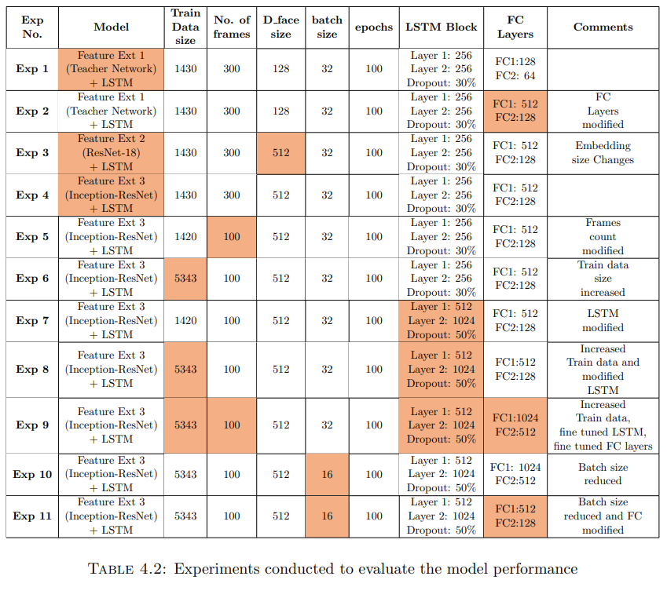

# Multi-task Learning for Student Mental State Recognition from Facial Expressions in-the-wild

### ABSTRACT
E-Learning platforms are most effective when personalised, leading to higher engagement levels and promoting positive, sustained use. In their current state, these platforms have been designed as a one-size-fits-all solution with no adaptation to the emotional and cognitive abilities of students. By understanding learner engagement and other mental states at various junctures of the learning process and how these change throughout the learning activity, we can intuitively design interfaces that support better learner cognition, help decrease dropout rates, and provide a personalised learning experience.
  
In this work, I propose an end-to-end pipeline for “Multi-task Learning of Student Affect Recognition from Facial Expressions in-the-wild”. I have experimented with three novel Convolutional Neural Networks (CNN) and Long Short-Term Memory (LSTM) hybrid networks. 

Student mental state recognition in the wild has been formulated as a Spatio-temporal problem, and the proposed networks are trained and evaluated on the DAiSEE e-learning video dataset. The deep CNN models serve as feature extractors to produce spatial feature embeddings from successive video frames. The LSTM-based sequence learning arm captures the temporal changes in videos to determine how the mental states change over time. The project also investigates the effects of modifying various parameters and specifications of these networks.
 

The contribution of this work is three-fold:
1. A Proof-of-Concept(POC) for multi-task video classification of student mental States. The proposed approach predicts the level (very low, low, high and very
high) of four student mental states - Engagement, Confusion, Boredom, Frustration.
2. Spatio-Temporal analysis of facial features for student affect recognition by combining deep Convolutional Neural Network (CNNs) based feature extractors and
sequence learning via LSTMs.
3. A study on the performance of three SOTA networks as a feature extractor for online learning problems. The three networks are:
• Feature Extractor 1: Inspired by a teacher network proposed by [Schoneveld et al. (2021)] trained on Google FEC dataset [Vemulapalli and Agarwala
(2019)] and AffectNet dataset [Mollahosseini et al. (2017)]
• Feature Extractor 2: ResNet18 [He et al. (2016)] pre-trained on ImageNet dataset [Deng et al. (2009)]
• Feature Extractor 3: Inception-ResNet-V1 [Szegedy et al. (2015)] pre-trained on VGGFace2 [Cao et al. (2018)].

### Results

11 Experiments were conducted with the three proposed pipelines, each experiment differing in Train Data size, No. of frames, Embedding size, batch size, epochs, LSTM Block or Fully Connected Layers. The vanilla versions of these networks were trained on only 1429 videos due to storage constraints, contrary to 5358 train videos and 1429 validation videos used by the baseline models. Despite this limitation, all three vanilla architectures often slightly outperformed the baselines or delivered comparable results. Although the performance was not significantly greater than the state-of-the-art results, I have successfully demonstrated through Experiments 5-11 on the Inception-Resnet-V1-based model that the proposed architectures have a great potential to outperform the baselines substantially.
 
This project’s overarching objective was to demonstrate the potential of a new approaches for e-learning emotion recognition which the research community could further
explore and highlight a few future directions that could be explored, which has been
successfully fulfilled
